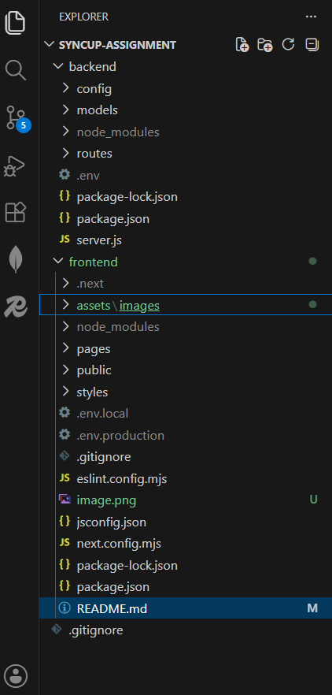
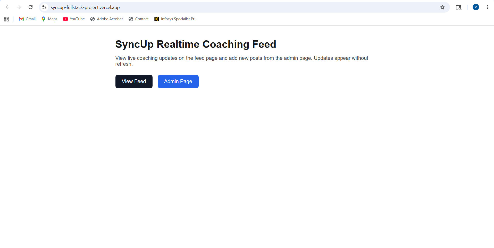
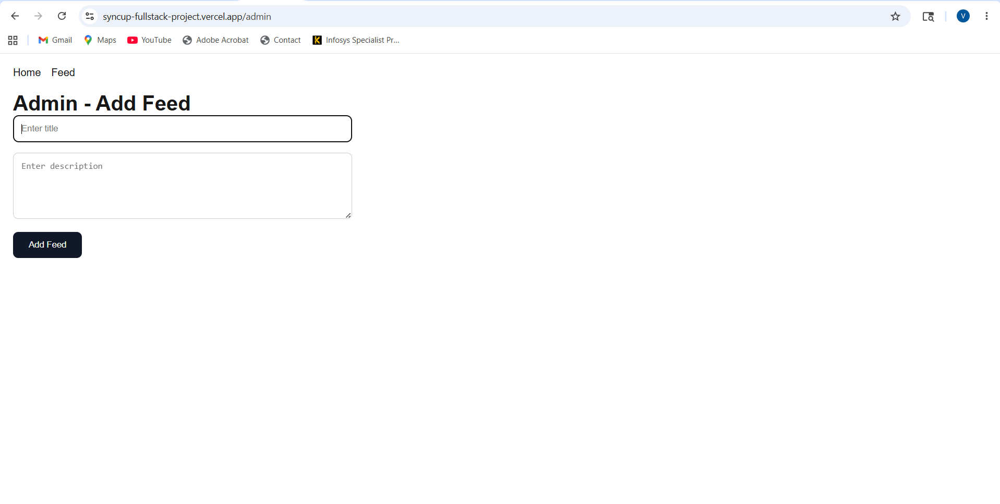
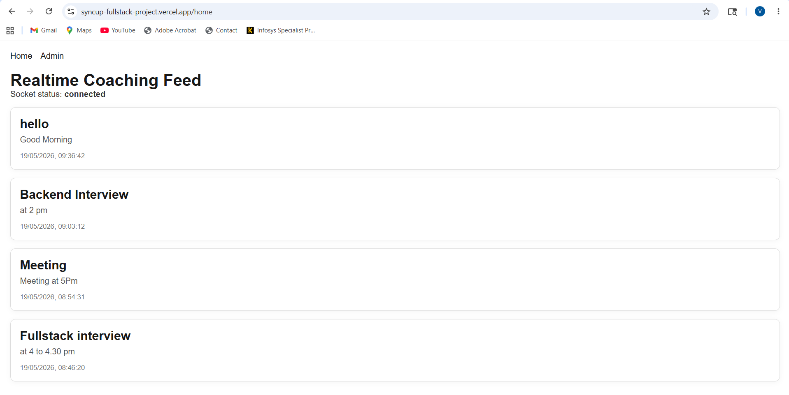

#  SyncUp Real-Time Coaching Feed Application

A real-time coaching feed application built using **Node.js, Express, MongoDB, Redis, Socket.IO, and Next.js**.  
It supports live feed updates without page refresh and uses caching for better performance.

---

## 📌 Features

- Create feed posts (Admin)
- View real-time feed updates (Users)
- GET /feed API with Redis caching
- POST /feed API to add new feed
- WebSocket (Socket.IO) for real-time updates
- Next.js frontend (Home + Admin page)
- Auto update feed without refresh

---

## 🛠️ Tech Stack

### Backend:
- Node.js
- Express.js
- MongoDB
- Redis (Caching)
- Socket.IO

### Frontend:
- Next.js
- React.js
- Axios
- Socket.IO Client

### Deployment:
- Backend: Render
- Frontend: Vercel
- DB: MongoDB Atlas
- Redis: Upstash Redis

---

## 📁 Project Structure

## 🖼️ Screenshots

## 🤝 Contributors

